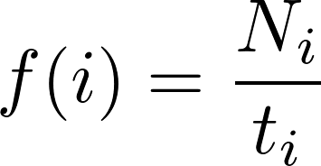

## Logs

**Note:** the number of bytes received per second in these
logs are limited by the hardcoded delay in the proccessing
loop of the Arduino microcontrollers. I set this delay to
100 milliseconds (0.1 seconds) initially to allow time to properly
send the CAN messages and flush any ouput streams. Without
the delay, the Arduinos' buffers can overflow. I might also experiment
with different delay values to see if they yield different results.  

**Note:** these values are driven by the Arduino Genuino/Uno  board, and
may vary with different CPUs. Thus the "normal" values shown here should not
be compared directly to that of a real CAN Bus within an automobile. Rather,
this data is focused towards a percentage decrease and then applied theoretically
towards an actual CAN Bus found in automobiles and other contexts. Also, the CAN
Bus shields were initialized to communicate at *up to* 500 Kbits/s.  

---

### Control Group

#### Log |  Average Bytes Received Per Second
1. 79.84
2. 79.84  
**Total Average:** 79.84

---

### Experimental Group
#### Log |  Average Bytes Received Per Second
1. 75.92
2. 76.24  
**Total Average:** 76.08

---

### Percent Decrease in Average Bytes Received Per Second:
#### Log |  Percent Decrease
1. 4.91%  
2. 4.51%   
**Total Average:** 4.71%

Thus, we can infer that, given a real CAN Bus running at 500 kbit/s,
the security measures proposed would slow the network speed to ~476.45 kbit/s.
And one running at 1 Mbit/s would theoretically slow to ~975.77 kbit/s. Of course, these
values still might be altered by the specific hardware used on nodes in the CAN Bus.  

---

### Control v. Experimental Comparison  

#### Log #2 Comparison
  

---

**Note:** these values are driven by the Arduino Genuino/Uno  board, and
may vary with different CPUs. Thus the "normal" values shown here should not
be compared directly to that of a real CAN Bus within an automobile. Rather,
this data is focused towards a percentage decrease and then applied theoretically
towards an actual CAN Bus found in automobiles and other contexts.  

### Time Measurement to Fully Sign and Send Authentication Messages
The complete time it took to create the HMAC and timestamp authentication
messages, as well as send them was 1,513.673 microseconds, or 1.513673 milliseconds.  

  

---

## Measured Probability of Successful Attacks

### Denial of Service (DoS) Attack  
Without security measures--that is, CAN's normal state, an attempted DoS attack will succeed 100% of the time. However, with the security features I implemented, the success rate dropped to _____.  

### Replay Attack
In the same manner as the DoS attack, an attempted replay attack will succeed 100% of the time with CAN as-is. However, with the security features I implemented, success rate drops relative to the set "freshness" factor. This is a value, *t_i* set such that a CAN message with a given frame ID, *i* must contain a timestamp greater than *lastTimestamp_i + t_i*, where *lastTimestamp_i* is the stored value on the ECU for the last received timestamp for frame ID *i*. Thus, the success rate with this security becomes , where *N_i* is the total number of CAN frames sent for the *ith* frame ID. 
